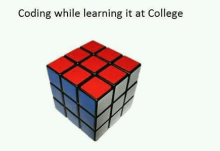
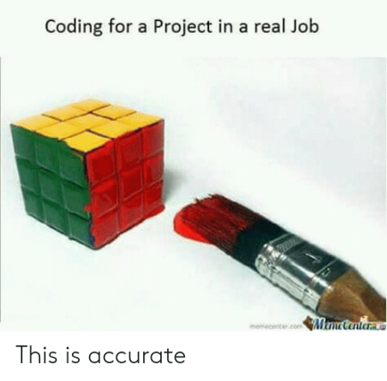
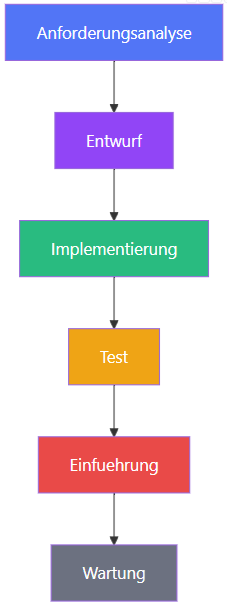
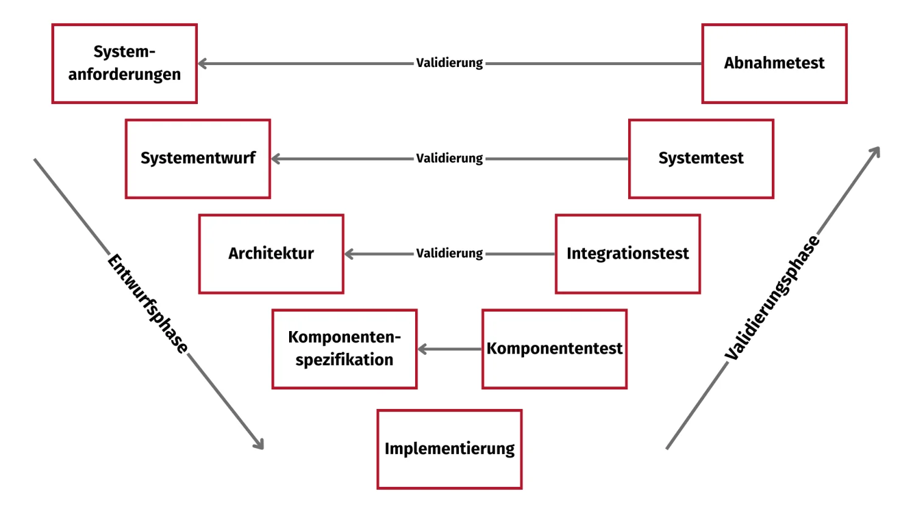
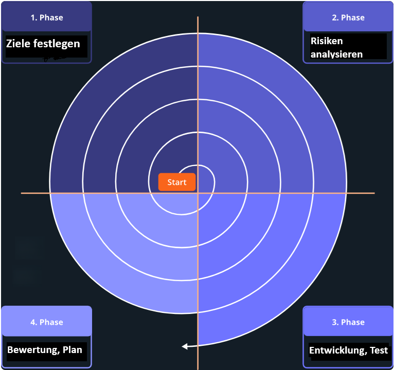
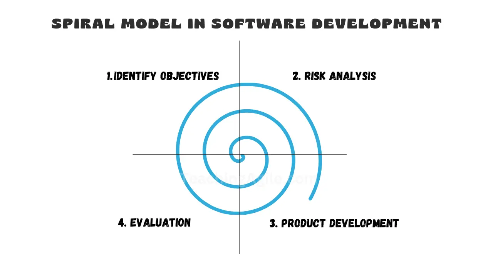
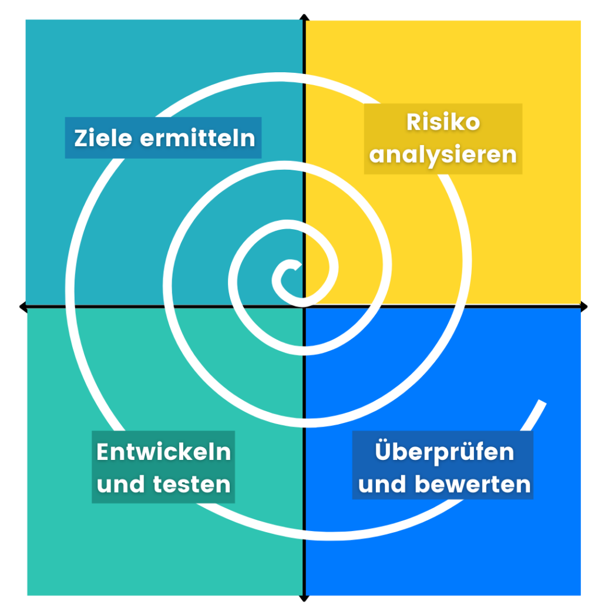
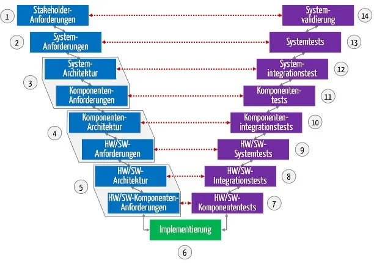
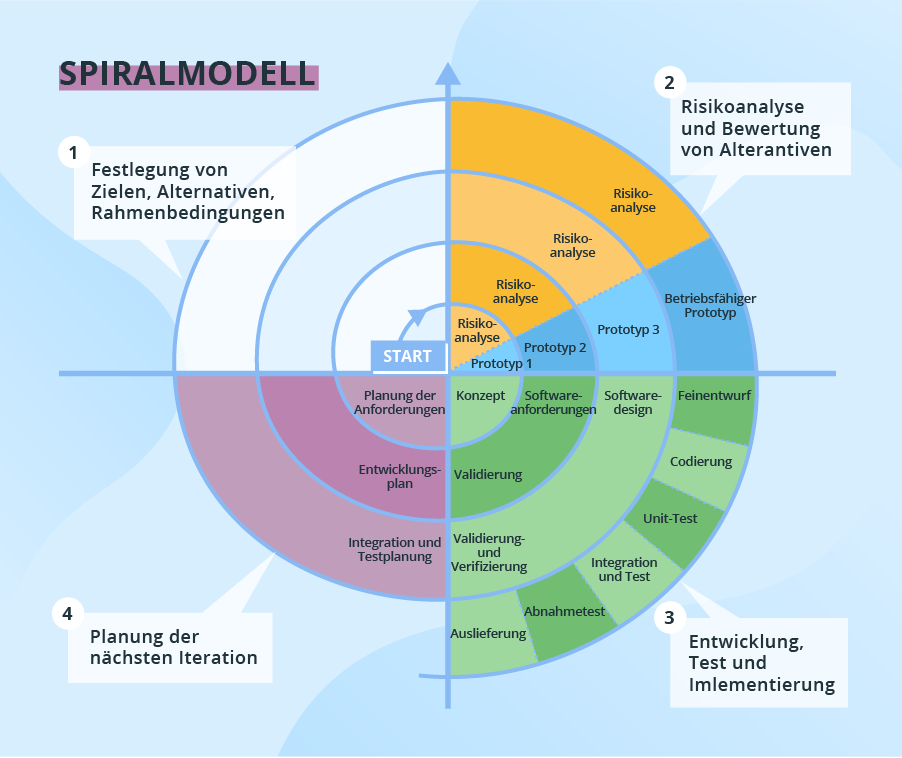

## Theorie und Praxis ...

```{r}
library(knitr)
```

::::: columns
::: {.column .fragment}
```{r}
#| out-width: "100%"


```
:::

::: {.column .fragment}
```{r}
#| out-width: "100%"


```
:::
:::::

[Quelle: memecenter.com]{style="font-size: 1rem"}

---

### Vorgehensmodelle in der Softwareentwicklung

<br>

::: incremental
- Wasserfall-Modell
- V-Modell
- Spiral-Modell
:::

## Der "Oldie": Das Wasserfall-Modell

```{r}

```

[Skógafoss in Island]{style="font-size: 1.6rem"}

[Quelle: GettyImages / dertour.de]{style="font-size: 1rem"}


## Das Wasserfall-Modell grafisch

```{r}
#| fig-align: "center"


```

[Quelle: it-lernapp.de]{style="font-size: 1rem; text-align: right; display: block;"}


## Wasserfall-Modell: Phasenbeschreibung

:::: {.columns style="font-size: 1.7rem"}

::: {.column width="30%"}

Phase |
------|
1. Anforderungs-<br>analyse |
2. Entwurf<br>&nbsp; |
3. Implementierung |
4. Test |
5. Einführung<br>&nbsp; |
6. Wartung<br>&nbsp; |

:::

::: {.column .fragment width="30%"}

Beschreibung |
-------------|
Anforderungen sammeln |
Systemarchitektur festlegen |
Programmierung |
Qualitätssicherung |
Deployment beim Kunden |
Fehlerbehebung, Update |

:::

::: {.column .fragment width="30%"}

Ergebnis |
---------|
Lastenheft<br>&nbsp; |
Pflichtenheft, Architektur |
Quellcode |
Testberichte |
Produktivsystem<br>&nbsp; |
Patches, neue Versionen |

:::
::::

::: notes

Unterschied Lastenheft vs. Pflichtenheft:
Lastenheft: WAS Auftraggeber braucht; Verfasser: Auftraggeber  
Pflichtenheft: WIE Auftragnehmer die Anforderungen umsetzt; Verfasser: Auftragnehmer

Wann Benutzerbeteiligung? Nur am Anfang
Weitere Änderungen danach -> neuer Auftrag!

:::


## Wasserfall-Modell: Geschichte, Einsatz

- Bereits 1956 von **Herbert D. Benington** beschrieben
- Vortrag 1983 neu aufgelegt
- Beschreibung 1970 von **Winston W. Royce** <br>(ohne Bezeichnung Wasserfall)
- Begriff "Wasserfallmodell" später von **Barry Boehm** geprägt

::: incremental

- Geeignet für Projekte mit **stabilen, klar definierten Anforderungen** und **regulatorischen Vorgaben**
- Beispiele: Medizintechnik, Pharmazie, Maschinenbau

:::


## Wasserfall-Modell: Vorteile

::: incremental

- Phasen klar abgegrenzt
- Einfache Möglichkeiten der Planung und Kontrolle
- Kosten und Umfang klar abschätzbar
- ACHTUNG: Wenn Anforderungen stabil bleiben!

:::


## Gescheitertes Wasserfall-Projekt: FBI

:::: {style="font-size: 2rem"}

::: fragment

- Geheimdienst **FBI**: United States Federal Bureau of Investigation
- Projekt: **Virtual Case File (VCF)**, 2000 - 2005,  
  sollte völlig veraltetes Fallmanagement-System ersetzen
- Kosten:  ca. 170 Millionen US-Dollar
- Ergebnis: Projekt abgebrochen, nicht nutzbar

:::

::: fragment

### Gründe

- Wiederholte Veränderungen und Erweiterungen der Anforderungen
- Versuch einer plötzlichen, vollständigen Systemumschaltung ohne Übergangsphase
- Zu starres Projektmanagement; mangelhafte Kommunikation
- **Klassisches Wasserfall-Problem!**

:::
::::


## Wasserfall-Modell: Nachteile

::: incremental

- Klare Abgrenzung der Phasen in komplexen Projekten oft unrealistisch
- Fehler werden oft erst am Ende erkannt
- Geringe Flexibilität durch strikten Ablauf

:::


## Wasserfall-Modell: Frage

:::: {style="font-size: 1.9rem"}

Was sind die Phasen des klassischen Wasserfallmodells in der Softwareentwicklung?

**A** Sprint Planning, Daily Standup, Sprint Review und Retrospektive - iterativ in Zyklen  
**B** Inception, Elaboration, Construction, Transition - inkrementell mit Meilensteinen  
**C** Analyse, Design, Implementierung, Test, Wartung - sequentiell ohne Rücksprünge  
**D** Idee, Prototyp, Markteinführung und Skalierung - phasenweise mit Feedback-Schleifen  

::: fragment

Richtig ist **C**.

:::

::: fragment

Wasserfallmodell: Lineare Phasen; jede abgeschlossen, bevor nächste beginnt.  
Vorteile: Klare Struktur, Dokumentation.  
Nachteile: Unflexibel bei Änderungen, Fehler spät erkannt. Heute oft durch agile Methoden ersetzt.

:::
::::


## Das V-Modell

```{r}

```

[Quelle: alphaprogression.com]{style="font-size: 1rem"}


## Das V-Modell grafisch

::: {style="font-size: 2.1rem"}

Das **V-Modell** erweitert das Wasserfall-Modell um eine Teststrategie:  
Jeder **Entwicklungsphase** steht eine **Testphase** gegenüber.

:::

:::: columns
::: {.column width="80%"}

```{r}

```

:::

::: {.column width="20%"}
::: {style="font-size: 2rem"}

Testphase:

Validierung
Verifikation

:::

<br><br><br><br><br>

[Quelle: iapm.net]{style="font-size: 1rem"}

:::
::::


## V-Modell: Geschichte, Einsatz

- Vorgeschlagen von **Barry Boehm** 1979
- Erweiterung des Wasserfall-Modells
- Verwendung auch bei der Entwicklung <br> mechatronischer Systeme

::: incremental

- Geeignet für **sicherheitskritische Systeme** mit klaren, stabilen Anforderungen, hohem Dokumentationsbedarf und verpflichtenden Prüf- und Abnahmeprozessen
- Beispiele: Zugleitsystem, medizinisches Diagnosesystem

:::


## V-Modell: Vorteile

::: incremental
- Klare Struktur, definierter Ablauf
- Klare Zuordnung von Anforderungen und Tests
- Gute Fehlererkennung durch Testphasen
- Gute Nachvollziehbarkeit und Dokumentation
:::


## Problematisches V-Modell: Bundeswehr

:::: {style="font-size: 2rem"}

- **HERKULES**-Projekt zur Standardisierung und Modernisierung der IT
- Laufzeit 2006 - 2016; Kosten: über 7 Milliarden Euro
- Ergebnis: Systeme z. T. nicht nutzbar; z. T. technisch korrekt, aber sinnlos; <br>z. T. vor der Abnahme schon veraltet
- Projekt umgebaut, neu verhandelt; als "teilweise erfolgreich" deklariert

::: fragment

### Gründe

- Starre Anforderungen: tausende Seiten, während sich IT-Landschaft schnell veränderte (Smartphones, Cloud, Cyber-Bedrohungen)
- Späte Tests; Probleme erst am Ende sichtbar
- Dokumentationslast: "Papier statt Produkt"
- Geringe Flexibilität; V-Modell schwierig bei riesigen Projekten

:::
::::

::: notes
Veränderte IT-Landschaft:  Sicherheitsstandards, Hardware-Generationen, Kommunikationswege
:::


## V-Modell: Nachteile

::: incremental
- Hoher Aufwand für Dokumentation
- Hohe Abhängigkeit von Testaktivitäten
- Geringe Flexibilität durch fest vorgegebene Phasen
- Annahme: Alle Anforderungen von Anfang an vollständig und korrekt erfasst  
  In der Praxis oft nicht der Fall!
- Mehr Flexibilität durch wiederholte Durchläufe  
  ("Mini-Vs")? Enorm aufwändig
:::


## V-Modell: Frage

:::: {style="font-size: 2.1rem"}

Im V-Modell steht jeder Entwicklungsphase auf der linken Seite eine entsprechende Testphase auf der rechten Seite gegenüber. Welche Testphase korrespondiert mit der Phase Architektur?

**A** Abnahmetest  
**B** Komponententest  
**C** Integrationstest  
**D** Systemtest  

::: fragment

Richtig ist **C**.  
Der **Architektur** ist der **Integrationstest** zugeordnet.  
Arbeiten die Module zusammen?  
Funktioniert der Datenaustausch zwischen den Komponenten?  

:::
::::


## Verifikation vs. Validierung

:::: {.columns style="font-size: 2.1rem"}

::: {.column width="25%"}

Begriff |
--------|
Verifikation <br>&nbsp; |
Validierung <br>&nbsp; |

:::

::: {.column .fragment width="45%"}

Frage |
------|
Bauen wir das Produkt richtig? |
Bauen wir das richtige Produkt? |

:::

::: {.column .fragment width="29%"}

Beispiel |
---------|
Code-Review, Unit-Test |
Abnahmetest <br>mit Kunde |

:::
::::


## Das Spiral-Modell

```{r}

```

[Rekonstruierter Riesen-Ammonit]{style="font-size: 1.6rem"}

[Quelle: bio-schmidhol.ch]{style="font-size: 1rem"}


## Spiral-Modell: Grundidee

1986 von **Barry Boehm** beschrieben

Iterativ-inkrementelles Modell

::: incremental

- Iterativ: Produkt wird in mehreren Durchläufen verbessert
- Inkrementell: Produkt wird in Teilen (=Inkrementen) geliefert

:::


## Spiral-Modell: Phasenbeschreibung

Kombination aus **iterativem Vorgehen** und **Risiko-Analyse**

:::: {.columns style="font-size: 2.1rem"}

::: column

Schritt |
--------|
1. Ziele festlegen <br>&nbsp; |
2. Risiken analysieren <br>&nbsp; |
3. Entwicklung <br>&nbsp; |
4. Bewertung |

:::

::: {.column .fragment}

Beschreibung |
-------------|
Was soll diese Iteration erreichen? |
Welche Risiken gibt es? Prototypen bauen |
Implementierung dieser Iteration inkl. Tests |
Review mit Stakeholdern <br> Planung nächste Iteration |

:::
::::


## Spiral-Modell grafisch

:::: columns
::: {.column width="80%"}

```{r}
#| out-width: 75%
#| out-height: 75%


```

:::

::: {.column width="20%"}

<br><br><br><br><br><br><br><br>

[Quelle: simpleclub.com / eigene Bearbeitung]{style="font-size: 1rem"}

:::
::::


## Spiral-Modell: Vorteile

::: {.incremental style="font-size: 2.1rem"}

- Gute Kontrolle über Kosten, Ressourcen, Qualität, <br> v. a. durch zentralen Stellenwert der **Risikoanalyse**
- Gute Abstimmung zwischen Design und technischen Anforderungen
- Frühe, fortlaufende Einbindung von Auftraggebern und Anwendern
- Geeignet für neuartige technische Umgebungen, <br> wenn Erfahrungswerte fehlen; <br>
  Projekte mit hohen **technischen Risiken**; unklare Anforderungen; wenn **Prototypen** benötigt werden
- Beispiele: Autonomes Fahrassistenzsystem; <br>Satelliten-Kommunikationssoftware
:::


## Gescheitertes Softwareprojekt: <br>US-Luftfahrtbehörde

:::: {style="font-size: 2rem"}

- US-Luftfahrtbehörde FAA (*Federal Aviation Administration*) wollte <br> **AAS = Advanced Automation System** entwickeln
- Laufzeit 1981 - 1994; Kosten > 2,6 Milliarden US-Dollar
- Ergebnis: Abbruch; stattdessen inkrementell gesteuerte Teilprojekte

::: fragment

### Gründe

- Nicht als Spiralmodell konzipiert, aber z. T. so gehandhabt
- Ständige Änderungen an Anforderungen: Endlosschleife (*Loop of Death*)
- Meilensteine ignoriert, Tests aufgeschoben
- Unrealistische Verfügbarkeit (< 3s Ausfallzeit/Jahr); <br>Risikomanagement hätte das früh entschärfen müssen

:::
::::

::: notes

Meilensteine ignoriert; besser wäre: vertraglich vereinbarte Zwischenstände fixieren
Tests aufgeschoben: z. B. viel zu später Belastungstest: zu wenige Displays gleichzeitig stabil betreibbar

:::


## Spiral-Modell: Nachteile

::: incremental
- Hoher Management-Aufwand
- Viele Entscheidungen erforderlich -> Verzögerungen
- Setzt Wissen über Risikoanalyse und Risikomanagement voraus;  
  in der Praxis oft begrenzt!
- Ungeeignet für kleinere Projekte mit geringem Risiko
:::


## Spiral-Modell: <br>Problematische Darstellung (1)

:::: columns
::: {.column width="80%"}

```{r}

```

:::

::: {.column .fragment width="20%"}
::: {style="font-size: 2rem"}

- Wo beginnt die Spirale?
- Welcher Schritt ist der zweite?
- Wo endet die Spirale?

:::
:::
::::


## Spiral-Modell: <br>Problematische Darstellung (2)

:::: columns
::: {.column width="65%"}

```{r}

```

:::

::: {.column .fragment width="35%"}
::: {style="font-size: 1.9rem"}
- In welcher Reihenfolge sind die Quadranten angeordnet?
- Was ist die erste, zweite und dritte Phase zu Beginn (innen)?
- In welcher Richtung verläuft die Spirale <br>(-> Uhr)?
:::
:::
::::


## Vergleich der drei Modelle

<br>

:::: {.columns style="font-size: 1.7rem"}

::: {.column width="20%"}

**Modell** |
-------|
Wasserfall |
V-Modell <br>&nbsp; |
Spiralmodell <br>&nbsp; |

:::

::: {.column .fragment width="30%"}

**Geeignet für?** |
--------------|
Stabile Anforderungen |
Sicherheitskritische Systeme |
Große, risikoreiche Projekte |

:::

::: {.column .fragment width="20%"}

**Flexibilität** |
-----------------|
Gering |
Gering <br>&nbsp; |
Mittel |

:::

::: {.column .fragment width="30%"}

Risiko |
-------|
Hoch bei Änderungen |
Mittel (frühe Tests) <br>&nbsp; |
Gering (Risikoanalyse) |

:::
::::


## Gruppenarbeit

Vergleichen Sie die Vorgehensmodelle <br> **Wasserfallmodell, V-Modell, Spiralmodell**.

Nennen Sie für jedes Modell:

- 2 Vorteile
- 2 Nachteile und 
- ein geeignetes Projektszenario.


## V-Modell, detaillierter

:::: columns
::: {.column width="75%"}

```{r}
#| out-width:  796px    # 612px
#| out-height: 559px    # 430px


```

:::

::: {.column width="25%"}

[Planung und Spezifikation]{style="color: blue; font-size: 1.8rem;"}
[Implementierung]{style="color: green; font-size: 1.8rem;"}
[Verifizierung, Validierung]{style="color: violet; font-size: 1.8rem;"}

<br><br><br>

[Quelle: johner-institut.de]{style="font-size: 1rem; text-align: right; display: block;"}

:::
::::


## Spiral-Modell, detaillierter

:::: columns
::: {.column width="75%"}

```{r}
#| out-width:  758px    # 902px
#| out-height: 630px    # 758px


```

:::

::: {.column width="20%"}

<br><br><br><br><br><br><br><br><br><br>

[Quelle: scnsoft.de]{style="font-size: 1rem; text-align: right; display: block;"}

:::
::::


## Ausblick

Oft mehr Flexibilität benötigt: **Agile Methoden**

- Scrum
- Kanban
- Extreme Programming (XP)

Iterativ, inkrementell, in kurzen Zyklen

Viel Eigenverantwortung für die Teams


## Frage zu Wasserfallmodell (1)

::: {style="font-size: 1.9rem"}

In welcher Situation ist das **Wasserfallmodell** gegenüber **agilem Vorgehen** besonders geeignet?

**A** Bei innovativen Projekten mit häufig wechselnden Anforderungen und hoher Unsicherheit  
**B** Bei Projekten mit stabilen, klar definierten Anforderungen und regulatorischen Vorgaben  
**C** Bei Start-up-Projekten, die keine feste Deadline und kein fixes Budget haben  
**D** Bei Projekten mit hoher Unsicherheit und noch nicht klar definierten Zielen  

::: fragment

Richtig ist **B**.

Das Wasserfallmodell eignet sich besonders für Projekte mit **stabilen Anforderungen**, z. B. in **regulierten Branchen** (Medizintechnik, Luftfahrt). Dort müssen alle Anforderungen vorab dokumentiert und genehmigt werden. Bei häufig wechselnden Anforderungen sind agile Methoden besser geeignet.

:::
:::


## Frage zu Wasserfallmodell (2)

::: {style="font-size: 1.9rem"}

Welcher grundlegende Unterschied besteht zwischen dem **Wasserfallmodell** und **agilen Vorgehensweisen**?

**A** Agile Methoden erfordern keinerlei Dokumentation, das Wasserfallmodell hingegen schon  
**B** Das Wasserfallmodell ist grundsätzlich schneller als agile Methoden  
**C** Das Wasserfallmodell wird nur für kleine Projekte eingesetzt, agile nur für große  
**D** Das Wasserfallmodell durchläuft die Phasen sequenziell und linear, während agile Methoden iterativ und inkrementell in kurzen Zyklen arbeiten  

::: fragment

Richtig ist **D**. *Hohe Prüfungswahrscheinlichkeit!*

Wasserfallmodell: Phasen (Anforderungen, Entwurf, Implementierung, Test, Betrieb) werden strikt nacheinander durchlaufen. Rückschritte aufwändig. Agile Methoden  arbeiten in kurzen Iterationen (z. B. Sprints), liefern regelmäßig lauffähige Software-Inkremente. Dadurch frühes Feedback und flexible Anpassungen an geänderte Anforderungen.

:::
:::


## Frage V-Modell vs. Wasserfallmodell

Worin liegt der Vorteil des V-Modells gegenüber dem Wasserfallmodell?

::: fragment

Zu jeder **Entwicklungsphase** wird **gleichzeitig** der passende **Testfall** definiert — Fehler werden systematischer und früher erkannt.

Es ist in Behörden und regulierten Branchen verbreitet.

:::


## Vielen Dank!

```{r, fig.align = "center", out.width = "50%", out.height = "50%"}
include_graphics("libs/_Images/coffee.jpg")
```

::: {style="color: green; text-align: center; font-size: 2.8rem"}
**Viel Erfolg bei allem!**
:::
