## Lokaler Computer-Experte ...

```{r}
library(knitr)
```

:::: columns
::: {.column .fragment width="70%"}

```{r}
#| out-width: "75%"

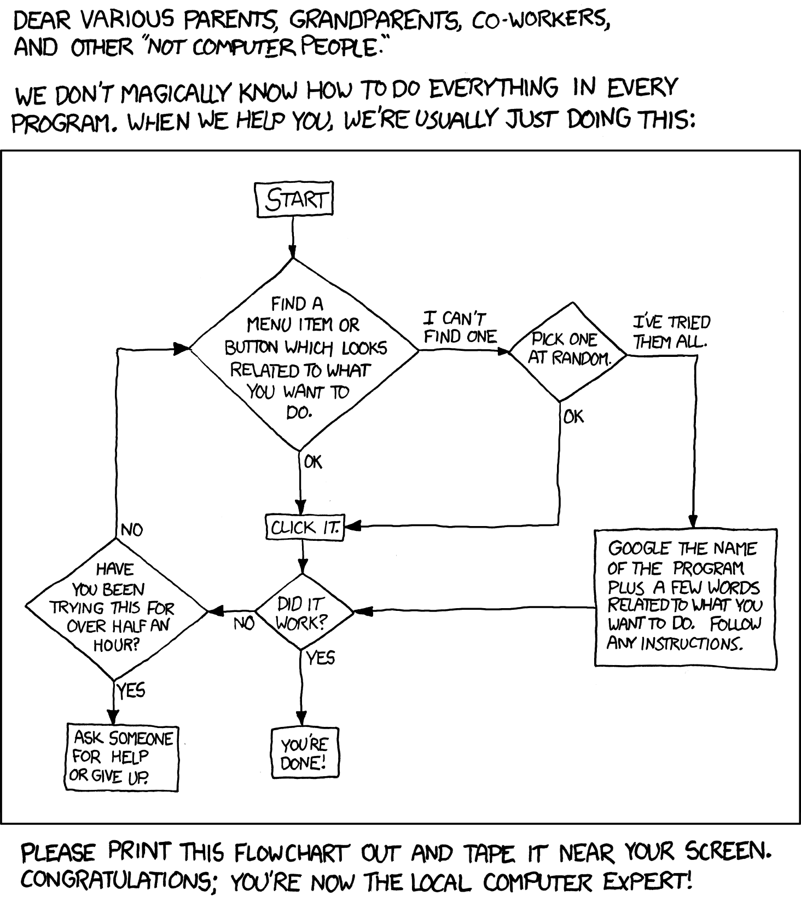
```


:::

::: {.column .fragment width="20%"}

<br>

[Kein echtes UML!]{style="font-size: 2.1rem"}

<br><br><br><br><br>

[Quelle: xkcd.com/627/]{style="font-size: 1rem;"}

:::
::::


## UML Diagramm-Übersicht

```{r}
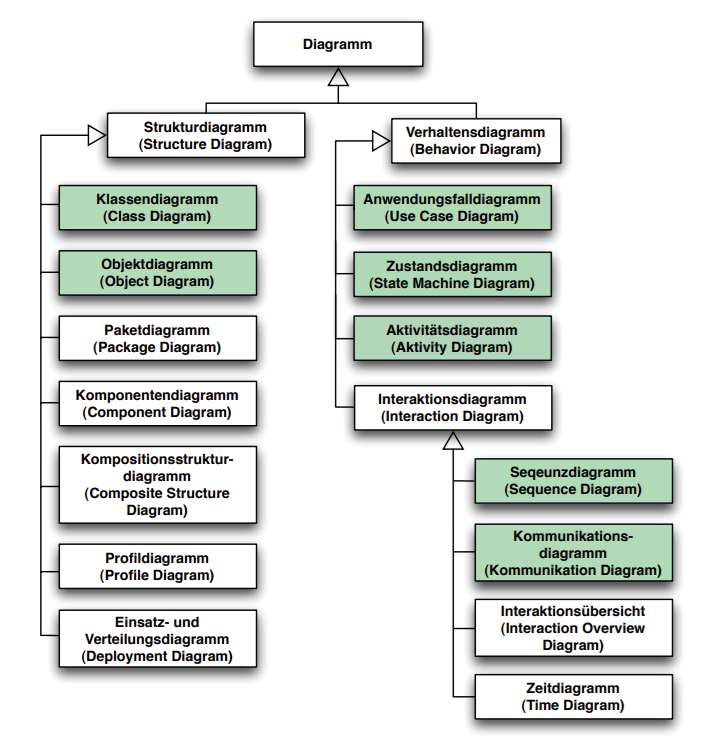
```

[Quelle: esb-dev.github.io]{style="font-size: 1rem"}


## Ein "echtes" Aktivitätsdiagramm

::::: columns
:::: {.column width="25%"}

```{r}
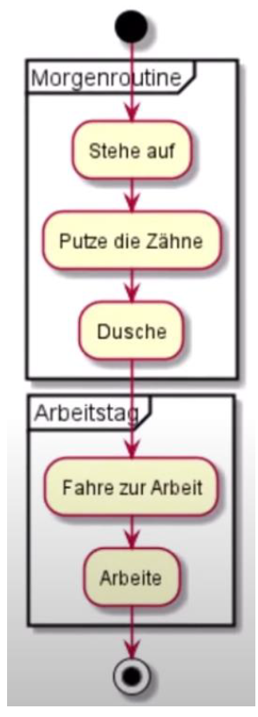
```

::::

:::: {.column .fragment width="70%" style="font-size: 2rem"}

- bildet die von einem System ausgeführten Aktivitäten ab
- zählt zu den **Verhaltensdiagrammen** in der UML

::: fragment

::: {.column width="50%"}

```{r}
#| out-width: "12%"
#| fig-align: "center"


```

```{r}
#| out-width: "50%"


```

```{r}
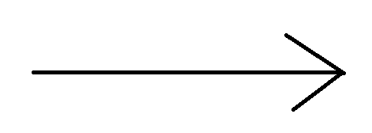
```

```{r}
#| out-width: "12%"
#| fig-align: "center"


```

:::

::: {.column}

Startknoten  
<br>Aktion  
<br><br>Konnektor  
<br>Endknoten

:::
:::
::::
:::::


## Aufgabe: Bibliothek

::: {style="font-size: 2rem"}

Stellen Sie sich vor, Sie besuchen die Bibliothek, um ein Buch auszuleihen.

Erstellen Sie ein Aktivitätsdiagramm, das den gesamten Ablauf Ihres Besuchs in der Bibliothek beschreibt.

- Sie betreten die Bibliothek.
- Sie gehen zur Buchabteilung und suchen ein Buch.
- Sie prüfen, ob das Buch ausleihbar ist.
- Sie verlassen die Bibliothek.

**Erstellen Sie das Aktivitäts-Diagramm mit draw.io. Speichern Sie es so, dass Sie es in der Folge weiter nutzen und verändern können.**

:::


## Lösung: Bibliothek

```{r}
#| fig-align: "center"

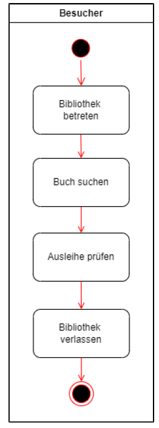
```


## Aktivitätsdiagramm: Verzweigung

:::: columns
::: column

```{r}
#| out-width: "75%"

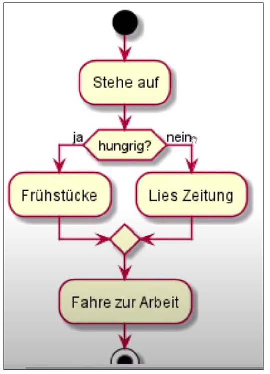
```

:::

::: {.column .fragment}

```{r}
#| out-width: "100%"

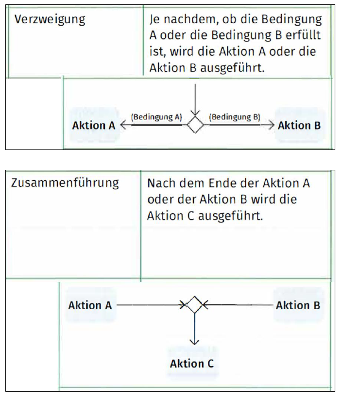
```

:::
::::


## Aufgabe: Bibliothek, Verzweigung

::: {style="font-size: 1.5rem"}

Sie besuchen die Bibliothek, um ein Buch auszuleihen.

Erstellen Sie ein Aktivitätsdiagramm **mit Verzweigung**.

- Sie betreten die Bibliothek.
- Sie suchen und finden ein Buch.
- Sie prüfen, ob es ausleihbar ist.
- Wenn ja (Buch ausleihbar):
  + Sie gehen zur Ausleihtheke.
  + Sie leihen das Buch aus.
  + Sie verlassen die Bibliothek.
- Wenn nein (Buch nicht ausleihbar):
  + Prüfen, ob Sie noch ein anderes Buch suchen
  + Falls ja:
    + Buch suchen
  + Falls nein:
    + Sie verlassen die Bibliothek.

:::


## Lösung: Bibliothek, Verzweigung

```{r}
#| fig-align: "center"

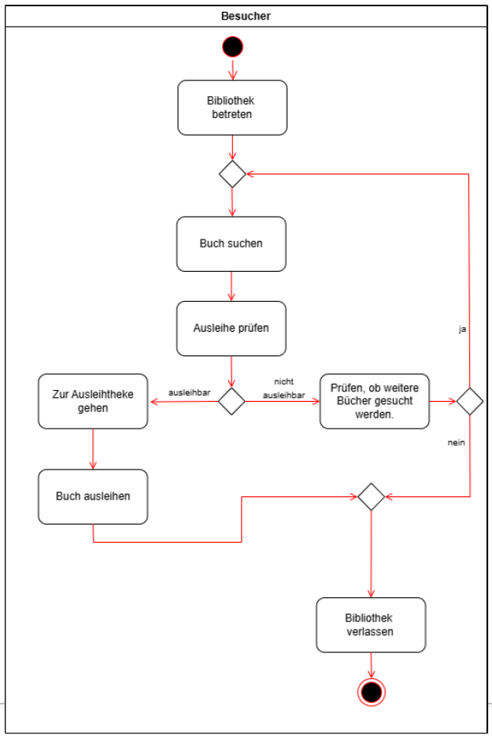
```

---

### Aktivitätsdiagramm: Parallele Verarbeitung

:::: columns
::: column

```{r}
#| out-width: "100%"

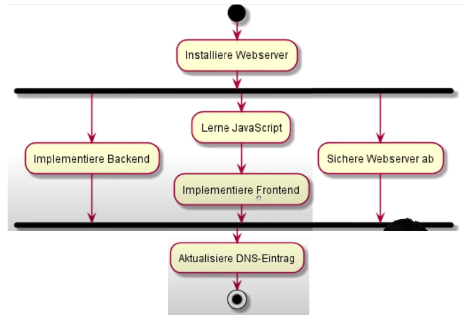
```

:::

::: {.column .fragment}

```{r}
#| out-width: "75%"

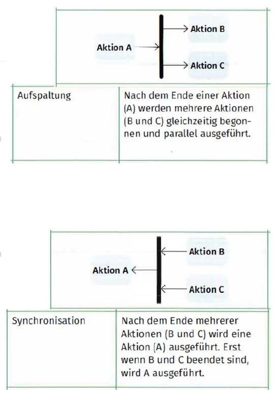
```

:::
::::


## Aufgabe: Bibliothek, parallel

:::: {.columns style="font-size: 1.4rem"}

::: {.column width="60%}

#### Wie zuletzt

Sie besuchen die Bibliothek, um ein Buch auszuleihen.

- Sie betreten die Bibliothek.
- Sie suchen und finden ein Buch.
- Sie prüfen, ob es ausleihbar ist.
- Wenn ja (Buch ausleihbar):
  + Sie gehen zur Ausleihtheke.
  + Sie leihen das Buch aus.
  + Sie verlassen die Bibliothek.
- Wenn nein (Buch nicht ausleihbar):
  + Prüfen, ob Sie noch ein anderes Buch suchen
  + Falls ja:
    + Buch suchen
  + Falls nein:
    + Sie verlassen die Bibliothek.

:::

::: {.column}

#### Neu

Nach der Ausleihe laufen vor dem Verlassen der Bibo zwei Prozesse parallel:

- Bibliotheksdatenbank muss das ausgeliehene Buch registrieren
- Arbeitskraft am Schalter stellt Ausleihbeleg aus.

:::
::::


## Lösung: Bibliothek, parallel

```{r}
#| fig-align: "center"

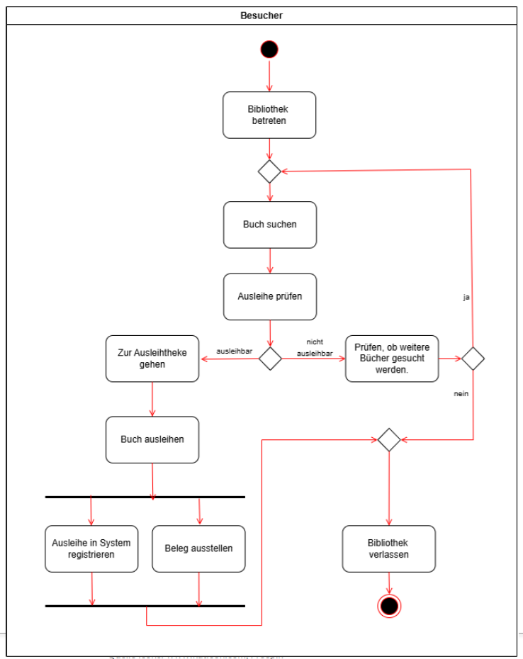
```

---

### Aktivitätsdiagramm: Swimlanes für Akteure

```{r}
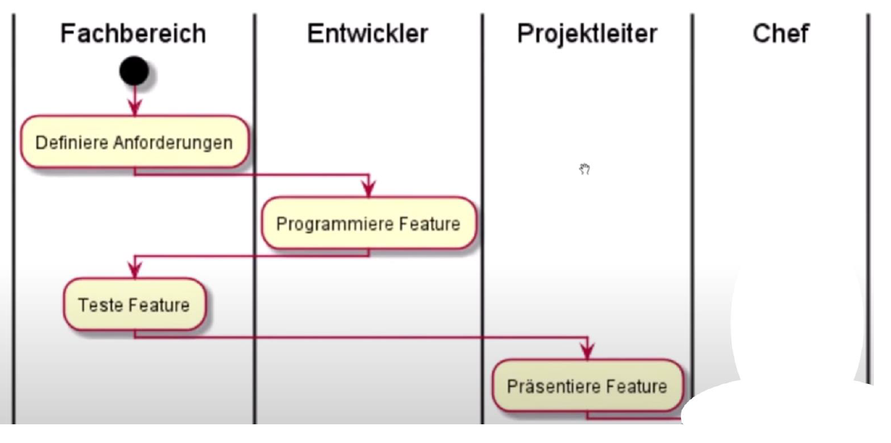
```

::: fragment

Swimlanes zeigen in Spaltenform, **wer** oder **welches System** für die jeweilige Aktivität zuständig ist.

:::


## Aufgabe: Bibliothek mit Swimlanes

<br><br><br>

Diagramm wie bisher, mit parallelen Prozessen vor dem Verlassen der Bibliothek.

**Neu: Kennzeichnen Sie die Verantwortlichkeiten anhand von Swimlanes.**


## Lösung: Bibliothek mit Swimlanes

```{r}
#| fig-align: "center"

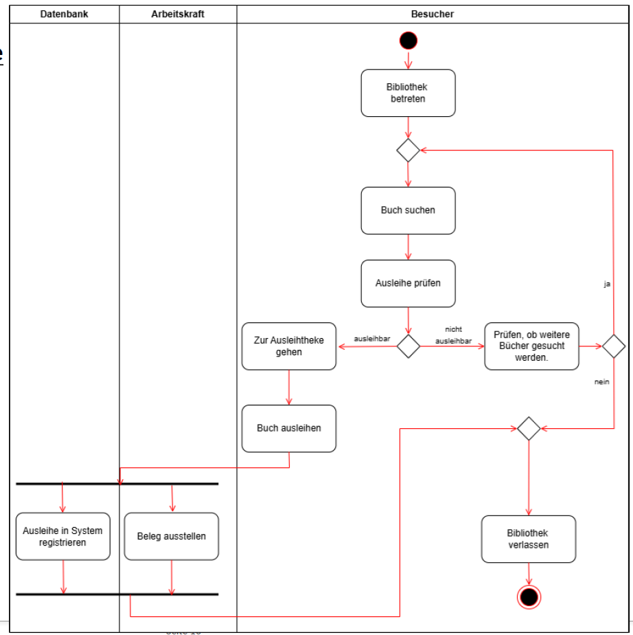
```


## Aktivitätsdiagramm: Übersicht

```{r}
#| fig-align: "center"

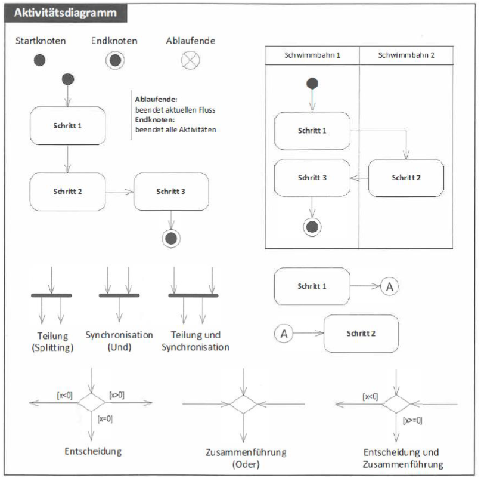
```


## Anwendungsfalldiagramme

#### Was ist ein Anwendungsfall?

- Verhalten, das ein modelliertes System nach außen anbietet
- Perspektive: Nutzer

::: fragment

#### Was ist ein Anwendungsfall-Diagramm *(Use-Case-Diagramm)*?

- Zeigt das externe Verhalten eines Systems aus Sicht der Nutzer
- Beantwortet die Frage:  
  ***Was soll mein geplantes System eigentlich leisten?***

:::


## Anwendungsfalldiagramm: Yachthafen

:::: columns
::: {.column width="70%" style="font-size: 1.4rem"}

### Liegeplatzverwaltung

- Projekt: Softwarekomponente für Vermietung von Liegeplätzen
- Teil des Yachthafen-Managements

Anforderungen:

::: fragment 

- Kunden können Liegeplatz mieten und kündigen 
- Kunden können sich im Yachthafen mit Yacht an- und abmelden 
- Mitarbeiter können einzelne Liegeplätze für Wartung sperren
- Nutzer des Programms können aktuelle Liegeplatzbelegung ansehen

:::

Projektteam:

- objektorientierte Entwicklung
- UML zur Planung

:::

::: {.column}

```{r}

```

[Quelle: PaterMcFly, Wikimedia Commons]{style="font-size: 1rem"}

::: {.fragment style="font-size: 1.6rem"}

Nächster Schritt in Softwareentwicklung?  
Wie können sich Entwickler einen Überblick über alle Anwendungsfälle verschaffen?

:::
:::
::::


## Anwendungsfalldiagramm: Yachthafen

```{r}
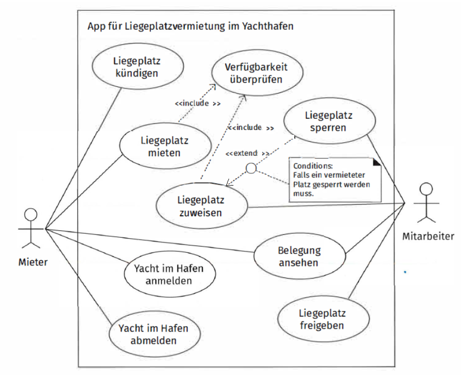
```


## Use-Case-Diagramm: Grundelemente

```{r}
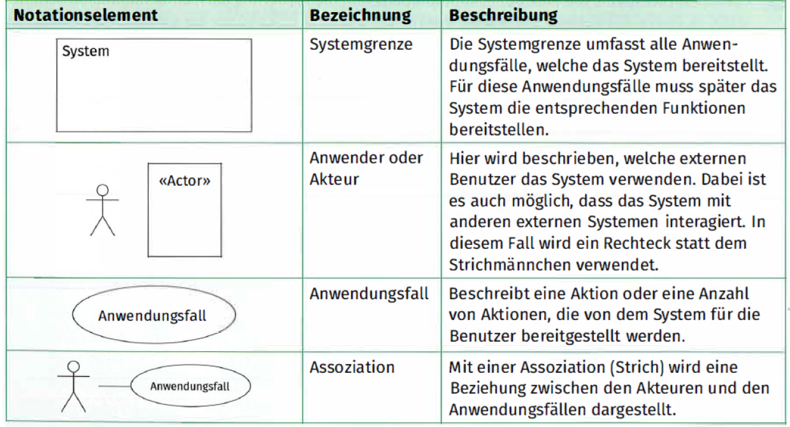
```


## Use-Case-Diagramm: Generalisierung

:::: columns
::: column

```{r}
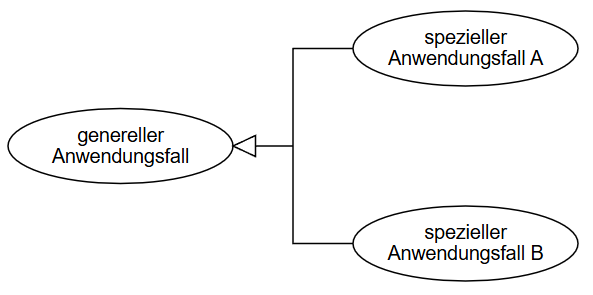
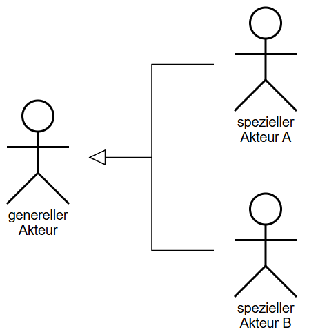
```

:::

::: {.column style="font-size: 1.9rem"}

#### Generalisierung / Spezialisierung

- zeigt Beziehung zwischen allgemeinem und spezialisiertem Element
- kann sowohl zwischen Anwendungsfällen als auch zwischen Akteuren dargestellt werden
- **Pfeilrichtung** beachten: <br> ***Vom speziellen zum generellen Element!***
:::
::::


## Aufgabe: Use-Case-D. Bibliothek

::: {style="font-size: 1.5rem"}

Bibliothek möchte neues System einführen zur Automatisierung:

- Ausleihe von Büchern
- Benutzerverwaltung
- Bücherverwaltung

**Aufgabe: Use-Case-Diagramm**

#### Anforderungen

- **Benutzer** kann Bücher ausleihen, Bücher zurückgeben und seinen Kontostand für ausgeliehene Bücher überprüfen
- **Premium-Benutzer** kann **zusätzlich** Bücher vorbestellen
- **Bibliothekar** kann neue Benutzer registrieren, Bücher hinzufügen und Bücher entfernen
- **Chef-Bibliothekar** kann **zusätzlich** Berichte über die Ausleihe erstellen und die Verwaltung der Bibliothek übernehmen

:::


## Lösung: Use-Case-D. Bibliothek

```{r}
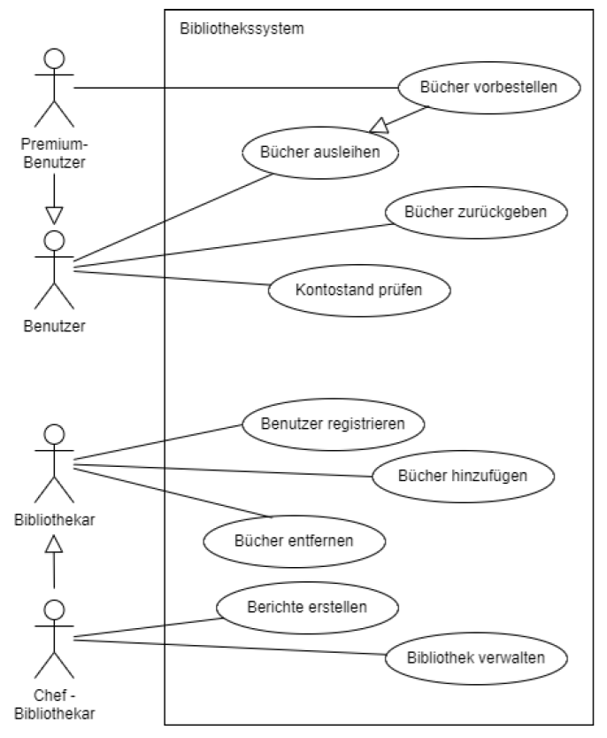
```


## Use-Case-D.: \<\<include\>\>

```{r}
include_graphics("libs/_Images/Use-Case-include.svg")
```

::: incremental

- Ein Anwendungsfall führt **immer** einen anderen mit aus
- Pflicht-Einbindung
- includierter Use Case ist wiederverwendbar
- **Pfeilrichtung: <br>vom Basis-Use-Case zum inkludierten Use-Case**
:::


## Aufgabe: Use-Case-D., include

Bibliothek, wie zuletzt

#### Neue Beziehungen

- Ausleihen von Büchern enthält immer **Berechtigungs-Prüfung**
- Registrieren eines Benutzers: immer **Bestätigungs-Email**

Use-Case-Diagramm zeichnen.


## Lösung: Use-Case-D., include

```{r}
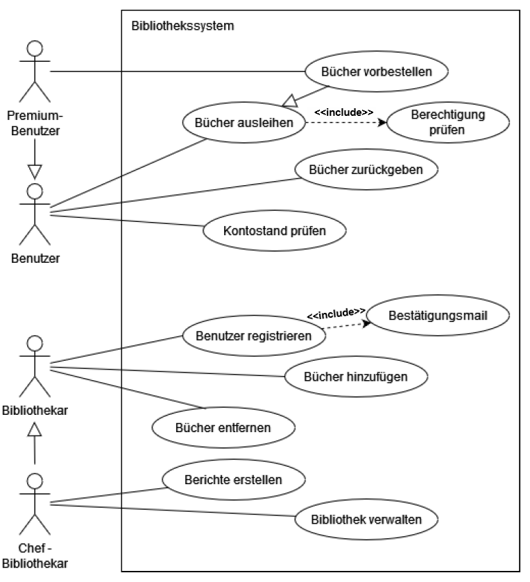
```


## Use-Case-D.: \<\<extend\>\>

```{r}
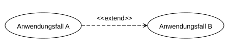
```

::: {.incremental style="font-size: 1.8rem"}

- Ein Anwendungsfall führt **optional** einen anderen mit aus
- Erweiterung **unter bestimmten Bedingungen**
- **Achtung: Pfeilrichtung <br>vom erweiternden Anwendungsfall zum Basis-Use-Case**
- Anders als bei \<\<include\>\>!!
- B ist Basis-Use-Case, A ist *extended use case*
:::

::: fragment

```{r}
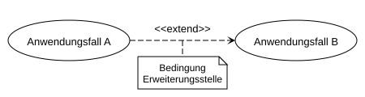
```

:::


## Aufgabe: Use-Case-D., extend

Bibliothek, wie zuletzt, mit include

#### Neue Sonderfälle 

- Bücher zurückgeben: manchmal müssen Gebühren erhoben werden  
  -> erweitert den Use Case "Bücher zurückgeben"
- Wenn Bibliothekar ein Buch hinzufügt: <br> manchmal müssen Buchinformationen validiert werden, <br> wenn sie unvollständig sind

Aufgabe: Use-Case-Diagramm mit zwei *Conditions*


## Lösung: Use-Case-D., extend

```{r}
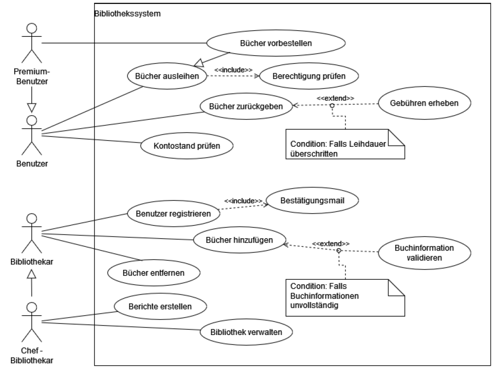
```


## Use-Case-Diagramm: So klappt's

::: {style="font-size: 1.9rem"}

- **Include** (zwingende Folge) und **extend (optionale Folge)** gut unterscheiden
- **Pfeilrichtungen** beachten:
  + Generalisierung / Spezialisierung: Vom speziellen zum generellen Element  
    Beispiel: vom *Premium-Benutzer* zum *Benutzer*
  + \<\<include\>\>: vom Basis-Use-Case zum inkludierten Use-Case  
    Beispiel: von *Bücher ausleihen* zu *Berechtigung prüfen*
  + \<\<extend\>\>: vom erweiternden Anwendungsfall zum Basis-Use-Case  
    Beispiel: von *Gebühren erheben* zu *Bücher zurückgeben*
- Use-Case-Diagramm ist **statisch**  
  Nicht für *Abläufe* verwenden!

:::


## Vielen Dank!

```{r, fig.align = "center", out.width = "50%", out.height = "50%"}
include_graphics("libs/_Images/coffee.jpg")
```

::: {style="color: green; text-align: center; font-size: 2.8rem"}
**Viel Erfolg mit UML!**
:::
